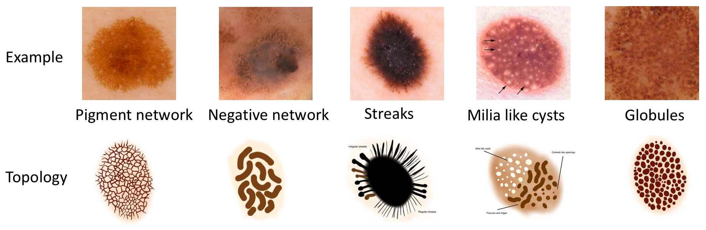

# segmentation-as-additional-channels
Using segmentation masks as additional channels for classification

All implemented methods realised in separated branches of this repository to distinguish them and to ease code debugging.

1. Base neural network based methods (NNmethods branch).
2. Direct using masks methods:
   - Zeroing masks (Zeroing_masks branch).
   - Std loss (Aux_loss branch).
   - Pair MSE loss (Pair_loss branch).
2. Multi-task learning with Y-Net like architecture (Y_net branch).
4. Future work on VOC dataset (VOC_ynet).

Each branch has description in its own Readme file.

## Dataset ISIC
This dataset contains 2594 images of 5 melanocytic attributes: globules, milia-like cysts, negative network, pigment network, streaks&dots. Examples with topology of attributes you can see at the picture below:

